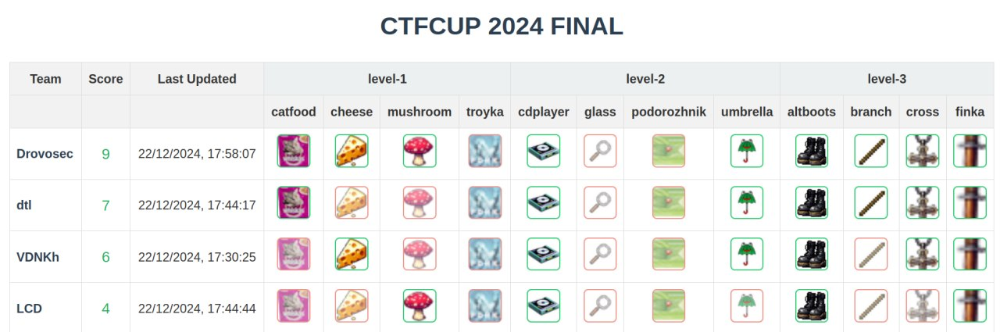
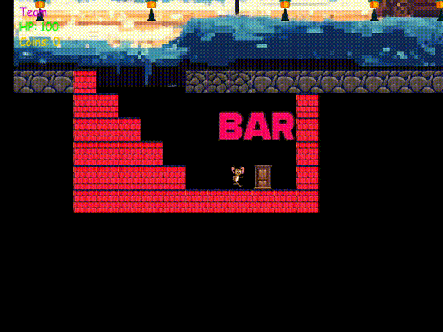
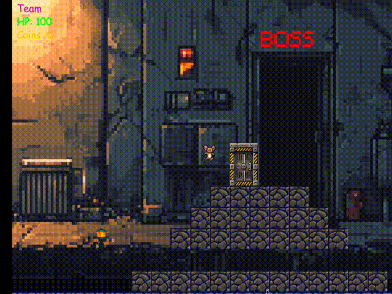
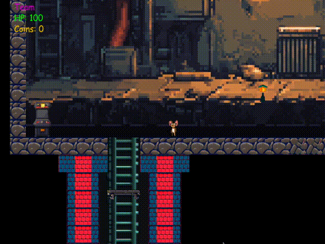

# ctfcup-2024-igra

Source code of the CTF game developed for the [CTFCUP 2024](https://ctfcup.ru/) finals.

Game engine is an improved version of the [CTFCUP 2023](https://github.com/C4T-BuT-S4D/ctfcup-2023-igra) finals game.

Game consists of 3 levels. There are 4 items on every level the player can collect.
Participants were given a source code of the game, level and the game server connection info.
The challenge was to collect as many items as possible on the level. To do so, participants were allowed to write
cheats, exploit the game engine bugs and so on.
Game format is inspired by [Google's hackceler8](https://capturetheflag.withgoogle.com/hackceler8).

Game Results:


## How to run

### Standalone

If you want to just play the game locally, run

```bash
go run cmd/client/main.go -a -l level-1
```

### With server

If you want to have the competition experience, you will need to run the server and the client.

Run the server with

```bash
AUTH_TOKEN=TestTeam:test go run cmd/server/main.go -l level-1 -s ":8085"
```

After you can run the client with

```bash
AUTH_TOKEN=TestTeam:test go run cmd/client/main.go -s "localhost:8085" -l level-1
```

## Items

| Level   | Item        | Type        | 
|---------|-------------|-------------|
| level-1 | catfood     | NPC-task    |
| level-1 | cheese      | Arcade      |
| level-1 | mushroom    | Engine hack |
| level-1 | troyka      | NPC-task    |
| level-2 | cdplayer    | Engine hack |
| level-2 | podorozhnik | NPC         |
| level-2 | umbrella    | Arcade      |
| level-2 | glass       | Boss        |
| level-3 | altboots    | Arcade      |
| level-3 | branch      | Engine hack |
| level-3 | cross       | Boss        |
| level-3 | finka       | NPC         |


## Screenshots

### Level 1


### Level 2

  

### Level 3

  


## Credits

- [Ivan Novikov](https://github.com/jnovikov): Game development, challenges development, level-design, scoreboard development.
- [Artem Mikheev](https://github.com/renbou): Game development, challenges development, level-design.
- [Roman Nikitin](https://github.com/pomo-mondreganto): Game development (bosses).
- [Nikita Pokrovsky](https://github.com/falamous): Challenges development.
- [Slonser](https://github.com/Slonser): "Slon.js" challenge development.
- [someone12469](https://github.com/someone12469): "Slava" challenge development.
- [Galilea Anri](https://vk.com/mangalileathecreativesquad): Artwork.

Beta testers:

- [@someone12469](https://github.com/someone12469)
- [@b1r1b1r1](https://github.com/b1r1b1r1)
